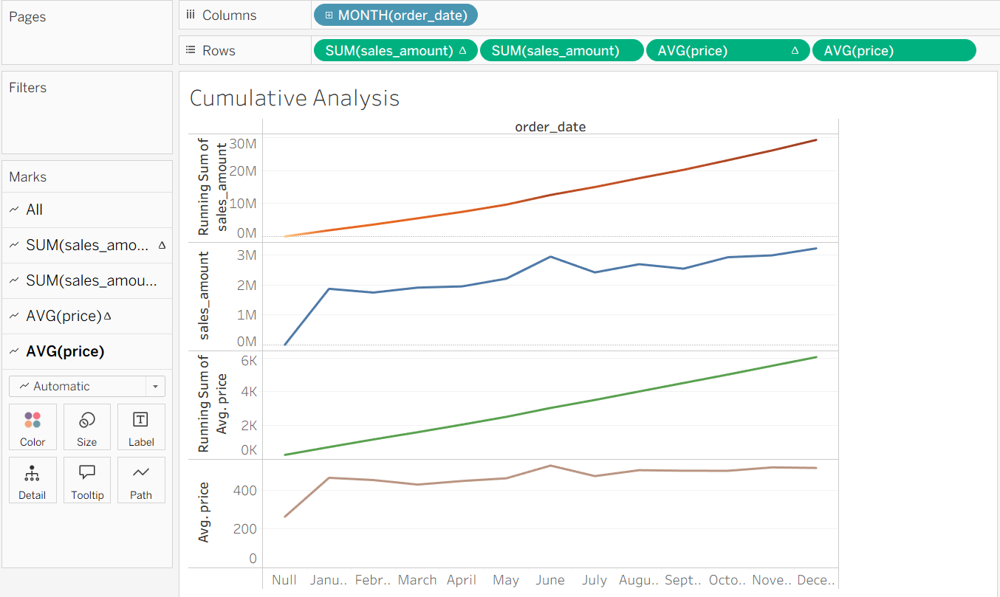

# 📊 Cumulative Sales Analysis Dashboard

> 🚀 A data analytics project focused on understanding **sales growth trends**, **cumulative performance**, and **pricing behavior over time** using SQL and Tableau.

---

## 📌 Objective

Analyze monthly sales performance by tracking total sales along with cumulative growth and pricing trends over time.

---

## 🛠️ Tools & Technologies

- **SQL** → Data transformation & analysis  
- **Tableau Public** → Data visualization & dashboarding  

---

## 📈 Metrics Used

- **Total Sales** → Overall revenue generated per month  
- **Running Total Sales** → Cumulative sum of sales over time  
- **Running Average Price** → Trend of average product price over time  

---

## 📊 Dashboard Preview

---

## 🔍 Key Insights

- 📈 Identifies **overall sales growth trend** over time  
- 🔄 Running total highlights **cumulative business performance**  
- 📊 Helps detect **consistent vs fluctuating growth patterns**  
- 💰 Tracks **pricing trends and variations** using running average  

---

## 🧠 Business Value

This analysis enables stakeholders to:

- Make **data-driven decisions** based on revenue trends  
- Monitor **long-term business growth**  
- Evaluate **pricing strategy effectiveness**  
- Support **forecasting and strategic planning**  

---

## 🗂️ Data Source

- **Table**: `gold.fact_sales`  
- **Layer**: Gold (Analytics-ready data)  

---

## 💡 About This Project

This project demonstrates:

- Writing optimized SQL queries using **window functions**  
- Transforming raw data into **analytical insights**  
- Building **interactive dashboards** in Tableau  
- Communicating insights in a **business-friendly manner**  

---

## 🔗 Connect With Me

If you found this useful or have feedback, feel free to connect! 🚀
