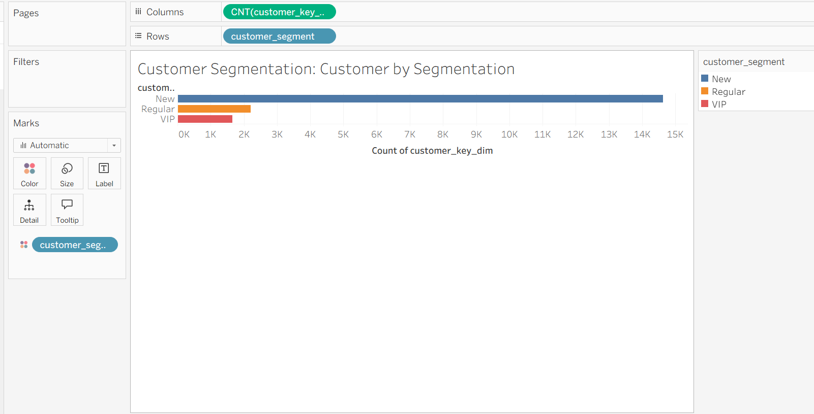
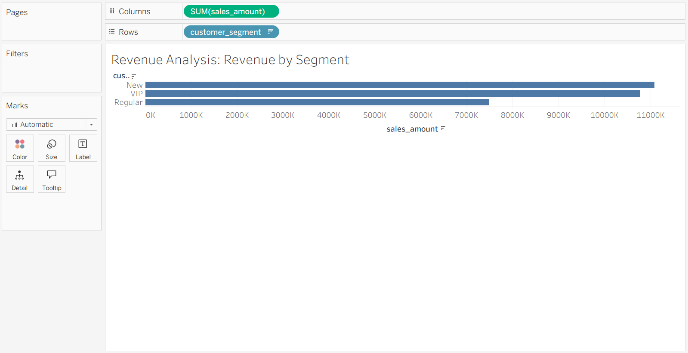
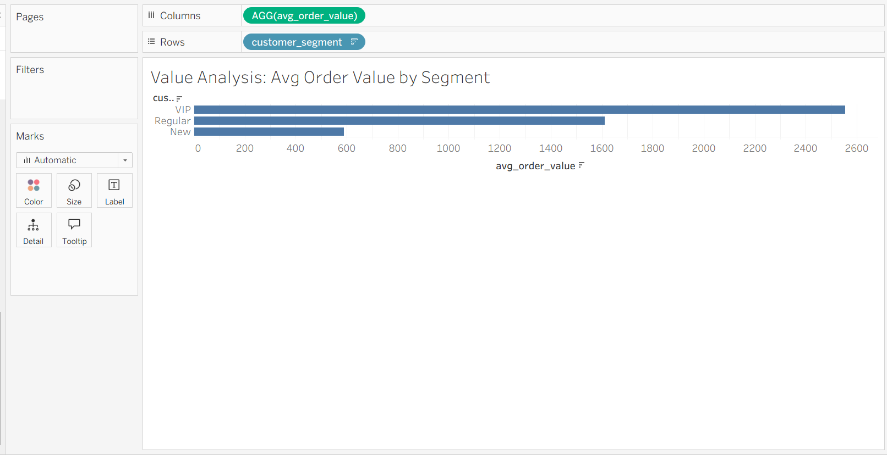
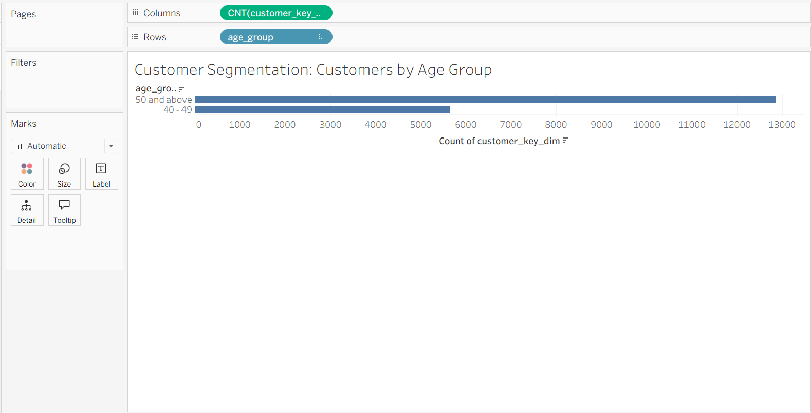
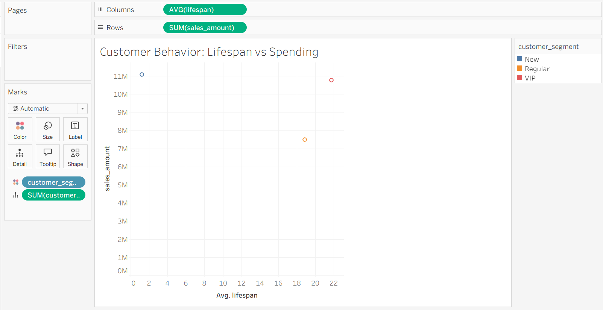
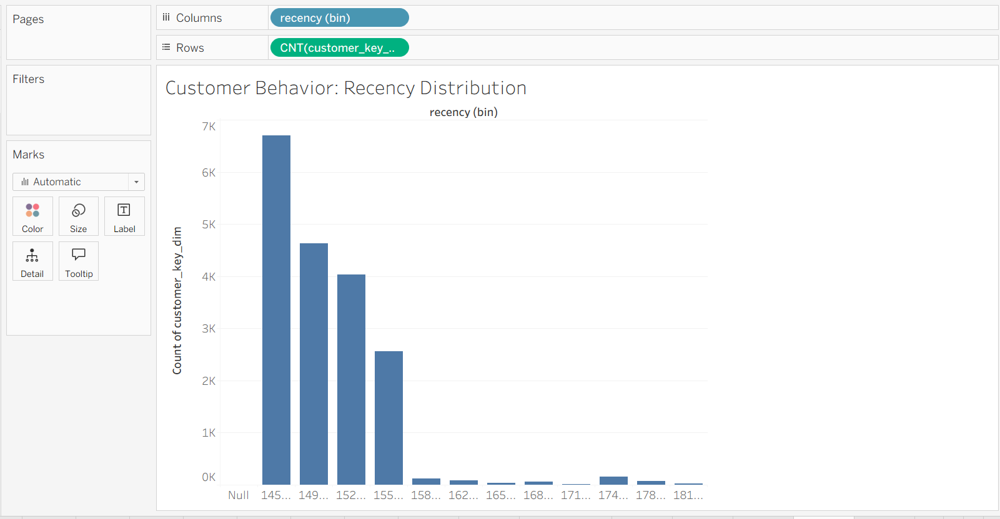

# 📊 Customer Report - Segmentation Analysis

> 🚀 A data analytics project focused on segmenting customers based on their purchase behavior and identifying high-value customer groups using multiple analytical perspectives.

---

## 📌 Objective

Group customers into different segments based on their spending behavior and purchase history to understand customer value distribution and engagement patterns.

---

## 🛠️ Tools & Technologies

- **SQL** → Data aggregation and segmentation  
- **Tableau Public** → Data visualization and dashboard creation  

---

## 📈 Metrics Used

- **Total Spending** → Total amount spent by each customer  
- **Customer Lifespan** → Duration between first and last purchase (in months)  
- **Customer Segment** → Classification (VIP, Regular, New)  
- **Recency** → Months since last purchase  
- **Average Order Value (AOV)** → Revenue per order  
- **Total Customers** → Number of customers  

---

## 📊 Dashboard 1: Customer Segmentation

### 🔍 Insights

- Distribution of customers across **VIP, Regular, and New segments**  
- Identifies proportion of **high-value vs low-value customers**  

---

## 📊 Dashboard 2: Revenue by Segment

### 🔍 Insights

- Shows which segment contributes the **most revenue**  
- Highlights importance of **VIP customers in business growth**  

---

## 📊 Dashboard 3: Average Order Value by Segment

### 🔍 Insights

- Compares **spending behavior per order** across segments  
- Identifies segments with **higher purchase value**  

---

## 📊 Dashboard 4: Customers by Age Group

### 🔍 Insights

- Distribution of customers across different **age groups**  
- Helps understand **target demographics**  

---

## 📊 Dashboard 5: Lifespan vs Spending

### 🔍 Insights

- Relationship between **customer longevity and spending**  
- Identifies **loyal high-value customers**  

---

## 📊 Dashboard 6: Recency Distribution

### 🔍 Insights

- Shows how recently customers have made purchases  
- Helps identify **active vs inactive customers**  

---

## 🧠 Business Value

This analysis helps stakeholders to:

- Identify and retain **high-value (VIP) customers**  
- Understand **customer behavior and engagement patterns**  
- Improve **targeted marketing strategies**  
- Detect **inactive customers for re-engagement campaigns**  
- Optimize **customer lifecycle management**  

---

## 🗂️ Data Source

- **Table**: `gold.fact_sales`  
- **Dimension Table**: `gold.dim_customers`  
- **Layer**: Gold (Analytics-ready data)  

---

## 💡 About This Project

This project demonstrates:

- Advanced **customer segmentation techniques**  
- Use of **behavioral metrics (recency, lifespan, AOV)**  
- Building **multi-dashboard analytical views** in Tableau  
- Converting transactional data into **actionable business insights**  

---

## 🔗 Connect With Me

If you found this useful or have feedback, feel free to connect! 🚀
