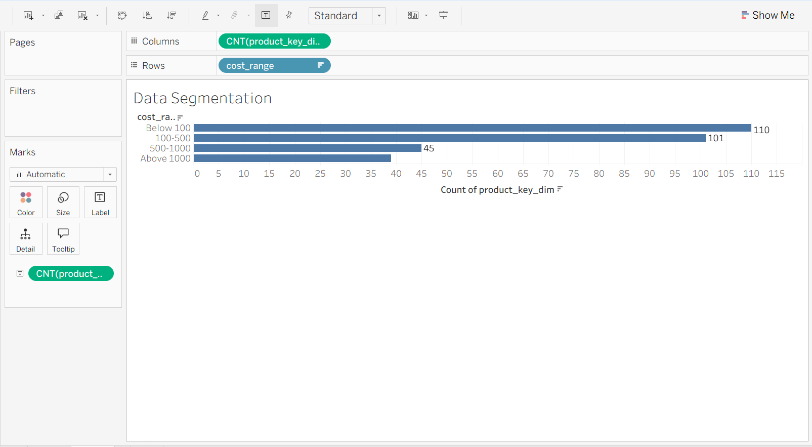

# 📊 Product Cost Segmentation Analysis

> 🚀 A data analytics project focused on segmenting products into different cost ranges to understand product distribution across pricing tiers.

---

## 📌 Objective

Segment products into defined cost ranges and analyze how many products fall into each segment to understand pricing distribution.

---

## 🛠️ Tools & Technologies

- **SQL** → Data transformation and segmentation  
- **Tableau Public** → Data visualization and dashboard creation  

---

## 📈 Metrics Used

- **Product Cost** → Price of each product  
- **Cost Range** → Categorization of products based on price  
- **Total Products** → Number of products in each cost segment  

---

## 📊 Dashboard: Product Cost Distribution

---

## 🔍 Key Insights

- Shows distribution of products across different **price ranges**  
- Identifies whether the catalog is focused on **low-cost or high-cost products**  
- Highlights **dominant pricing segments**  
- Helps detect imbalance in product pricing strategy  

---

## 🧠 Business Value

This analysis helps stakeholders to:

- Understand **product pricing distribution**  
- Identify opportunities to expand in **underrepresented price segments**  
- Support **pricing strategy decisions**  
- Optimize **product portfolio planning**  

---

## 🗂️ Data Source

- **Table**: `gold.dim_products`  
- **Layer**: Gold (Analytics-ready data)  

---

## 💡 About This Project

This project demonstrates:

- Use of **CASE statements** for segmentation  
- Implementation of **data bucketing techniques**  
- Building **distribution analysis dashboards** in Tableau  
- Converting raw product data into **business insights**  

---

## 🔗 Connect With Me

If you found this useful or have feedback, feel free to connect! 🚀
