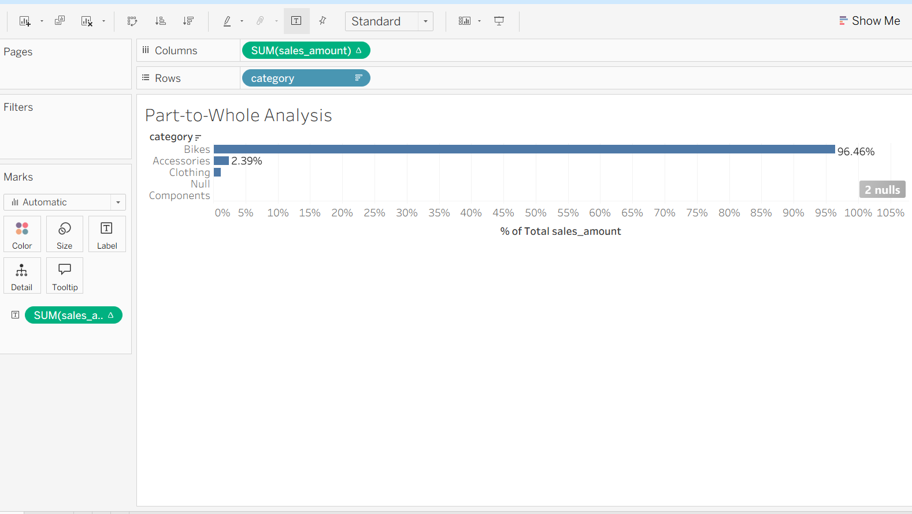

# 📊 Part-to-Whole Sales Analysis

> 🚀 A data analytics project focused on understanding how different product categories contribute to overall sales using part-to-whole analysis.

---

## 📌 Objective

Analyze the contribution of each product category to total sales and identify which categories drive the most revenue.

---

## 🛠️ Tools & Technologies

- **SQL** → Data aggregation and percentage calculation  
- **Tableau Public** → Data visualization and dashboard creation  

---

## 📈 Metrics Used

- **Total Sales** → Revenue generated by each product category  
- **Overall Sales** → Total revenue across all categories  
- **Sales Percentage** → Contribution of each category to total sales  

---

## 📊 Dashboard: Category Contribution to Sales

---

## 🔍 Key Insights

- Identifies which categories contribute the **highest share of total sales**  
- Highlights **top-performing and low-performing categories**  
- Helps understand **sales distribution across product categories**  
- Enables quick comparison of category-wise performance  

---

## 🧠 Business Value

This analysis helps stakeholders to:

- Focus on **high-revenue generating categories**  
- Identify **underperforming categories** for improvement  
- Make **data-driven decisions** on product strategy  
- Optimize **inventory and marketing efforts**  

---

## 🗂️ Data Source

- **Table**: `gold.fact_sales`  
- **Dimension Table**: `gold.dim_products`  
- **Layer**: Gold (Analytics-ready data)  

---

## 💡 About This Project

This project demonstrates:

- Use of **aggregation and window functions** for percentage calculations  
- Implementation of **part-to-whole analysis**  
- Building **category-level insights** using Tableau  
- Translating raw data into **actionable business insights**  

---

## 🔗 Connect With Me

If you found this useful or have feedback, feel free to connect! 🚀
