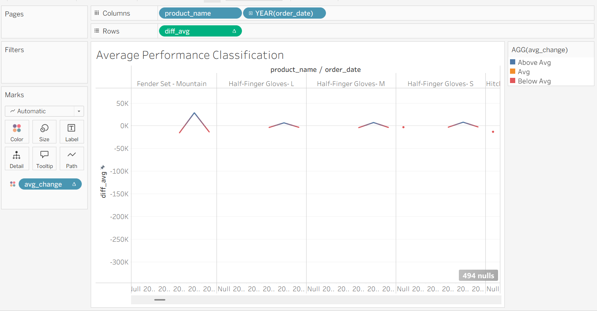
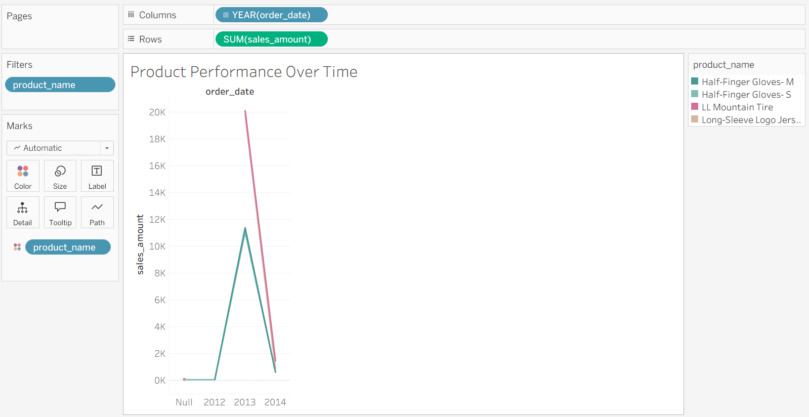
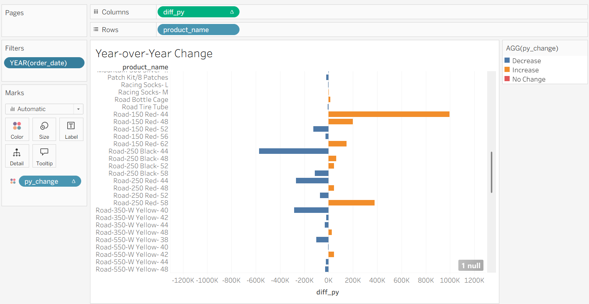

# 📊 Product Performance Analysis Dashboard

> 🚀 A data analytics project focused on evaluating product performance over time by comparing yearly sales with average performance and previous year trends.

---

## 📌 Objective

Analyze the yearly performance of products by comparing their sales against:
- The **average sales performance** of each product  
- The **previous year's sales (Year-over-Year analysis)**  

---

## 🛠️ Tools & Technologies

- **SQL** → Data transformation & analytical calculations  
- **Tableau Public** → Data visualization & dashboard creation  

---

## 📈 Metrics Used

- **Current Sales** → Total sales per product per year  
- **Average Sales** → Average sales of each product across all years  
- **Difference from Average (diff_avg)** → Performance vs average  
- **Previous Year Sales (py_sales)** → Sales from previous year  
- **Year-over-Year Change (diff_py)** → Growth or decline from previous year  

---

## 📊 Dashboard 1: Average Performance Classification

### 🔍 Insights

- Identifies products performing **Above Average**, **Below Average**, or **Average**  
- Helps quickly spot **high-performing vs underperforming products**  
- Useful for benchmarking product performance  

---

## 📊 Dashboard 2: Product Performance Over Time

### 🔍 Insights

- Shows **yearly sales trend** for each product  
- Helps identify **consistent performers vs volatile products**  
- Useful for tracking **long-term product growth**  

---

## 📊 Dashboard 3: Year-over-Year Change

### 🔍 Insights

- Highlights whether product sales are **increasing or decreasing year-over-year**  
- Helps detect **growth patterns and sudden declines**  
- Useful for evaluating **product lifecycle and market performance**  

---

## 🧠 Business Value

This analysis helps stakeholders to:

- Identify **top-performing and underperforming products**  
- Track **product growth trends over time**  
- Evaluate **year-over-year performance changes**  
- Support **data-driven decisions** for product strategy and investments  

---

## 🗂️ Data Source

- **Table**: `gold.fact_sales`  
- **Dimension Table**: `gold.dim_products`  
- **Layer**: Gold (Analytics-ready data)  

---

## 💡 About This Project

This project demonstrates:

- Use of **window functions** (`AVG`, `LAG`) for advanced analysis  
- Product-level performance evaluation  
- Building **multi-view dashboards** in Tableau  
- Translating raw data into **business insights**  

---

## 🔗 Connect With Me

If you found this useful or have feedback, feel free to connect! 🚀
